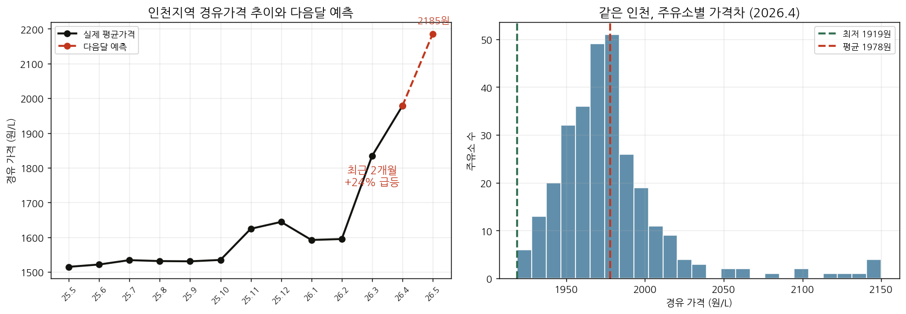

# 유가내비 (OilNavi) — 중소 물류업체를 위한 경유비 예보 서비스

한국석유공사 경유가격 공공데이터로 **다음 달 경유비를 예측**하고, 중소 물류·운송업체의 **예상 비용·대응 시점·최저가 주유소**를 알려주는 시계열 예측 프로젝트입니다.

> 제14회 산업통상부 공공데이터 활용 아이디어 공모전 출품작

---

## 실데이터가 보여준 문제

한국석유공사 인천지역 경유가격(307개 주유소, 2025.5~2026.4)을 분석한 결과:

- **최근 12개월 +30.6%** 상승 (1,515원 → 1,978원)
- **최근 2개월(2026.2→4)에만 +24% 급등** — 물류업체 직격탄
- 추세 지속 시 다음 달 약 **2,185원** 전망

중소 물류업체는 이 급등을 예측·대비할 수단이 없습니다. 유가내비가 그 격차를 메웁니다.



## 주요 기능

1. **경유비 예보** — 다음 달 가격 예측
2. **비용 시뮬레이터** — 차량 정보 입력 → 예상 경유비
3. **대응 추천** — 상승 예상 시 미리 주유·재고 확보 안내
4. **최저가 주유소 안내** — 같은 지역 내 가격차 활용

## 구성

| 파일 | 설명 |
|---|---|
| `data_loader.py` | 석유공사 경유가격 CSV 로더 (가로형→시계열 변환, 이상치 제거) |
| `forecast.py` | 다음 달 경유가 예측 + 시각화 |
| `model_compare.py` | 선형/부스팅/LSTM 3종 비교 실험 |
| `dashboard.html` | 웹 대시보드 시제품 |
| `incheon_diesel.csv` | 한국석유공사 인천지역 경유가격 실데이터 |

## 실행

```bash
pip install -r requirements.txt
python forecast.py          # 예측 + 그래프
python model_compare.py     # 모델 비교 실험
# dashboard.html 은 브라우저로 열기
```

## 데이터 출처

[공공데이터포털](https://www.data.go.kr) — 한국석유공사_인천지역 경유 가격 현황

다른 지역/유종으로 바꾸려면 같은 형식의 CSV를 `incheon_diesel.csv`로 교체하면 됩니다.

## 기술 스택

Python · pandas · scikit-learn · PyTorch · Chart.js

## 유의사항

예측값은 참고용이며 실제 거래 판단의 근거가 아닙니다.
