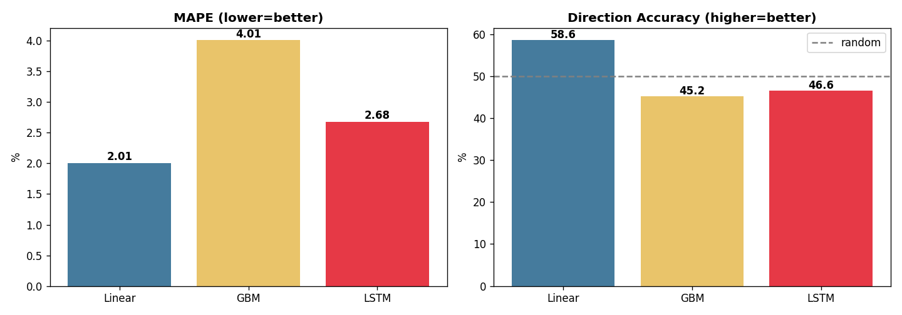

# 유가내비 (OilNavi) — 중소 물류업체를 위한 유가 예보 서비스

한국석유공사 국제유가 공공데이터로 **향후 2주 유가를 예측**하고, 중소 물류·운송업체의 **예상 연료비와 대응 시점**을 알려주는 시계열 예측 프로젝트입니다.

> 제14회 산업통상부 공공데이터 활용 아이디어 공모전 출품작 · 개인 학습/포트폴리오 프로젝트

---

## 핵심 아이디어

운송업은 연료비가 원가의 30~40%를 차지하지만, 중소업체는 대기업처럼 유가를 전망할 수단이 없습니다. 국제유가가 국내 연료비에 반영되기까지의 **약 2주 시차**를 이용해, 앞으로의 유가와 연료비를 미리 알려 정보 격차를 해소합니다.

## 주요 결과

세 가지 모델을 정면 비교한 결과, **단순 선형 모델이 딥러닝(LSTM)을 이겼습니다.**

| 모델 | MAPE (오차율) | 방향 적중률 |
|---|---|---|
| **Linear (채택)** | **1.9%** | **60.3%** |
| GradientBoosting | 3.9% | 44.2% |
| LSTM (딥러닝) | 2.5% | 45.5% |

유가처럼 랜덤워크 성격이 강한 시계열에서는 복잡한 모델이 과적합되기 쉽습니다. 성능·해석가능성·안정성을 함께 고려해 선형 모델을 선택했습니다.



## 구성

| 파일 | 설명 |
|---|---|
| `data_loader.py` | 석유공사 CSV 로더 (인코딩·컬럼 자동 감지, 없으면 시뮬레이션 폴백) |
| `forecast.py` | 유가 14일 예측 파이프라인 (피처→학습→평가→시각화) |
| `model_compare.py` | 선형/부스팅/LSTM 3종 비교 실험 |
| `dashboard.html` | 웹 대시보드 시제품 (예측 차트 + 연료비 시뮬레이터) |

## 실행 방법

```bash
pip install -r requirements.txt

# 예측 실행 (실데이터 없으면 시뮬레이션으로 동작)
python forecast.py

# 모델 3종 비교
python model_compare.py

# 대시보드는 dashboard.html 을 브라우저로 열기
```

## 실제 데이터 연결

1. [공공데이터포털](https://www.data.go.kr) 에서 "한국석유공사 국제유가" 검색, 또는 [오피넷](https://www.opinet.co.kr) → 국제유가에서 유종별 파일 다운로드
2. 받은 파일을 `oil_raw.csv` 로 이 폴더에 저장
3. `python forecast.py` 실행 — 로더가 자동으로 실제 데이터를 사용합니다

날짜·가격 컬럼은 자동 인식하며, `cp949`/`euc-kr` 등 공공데이터 인코딩도 자동 처리합니다.

## 기술 스택

Python · pandas · scikit-learn · PyTorch · Chart.js

## 유의사항

예측값은 참고용이며 실제 투자·거래 판단의 근거가 아닙니다. 연료비 환산은 세금·유통마진을 단순 가정한 추정치입니다.
